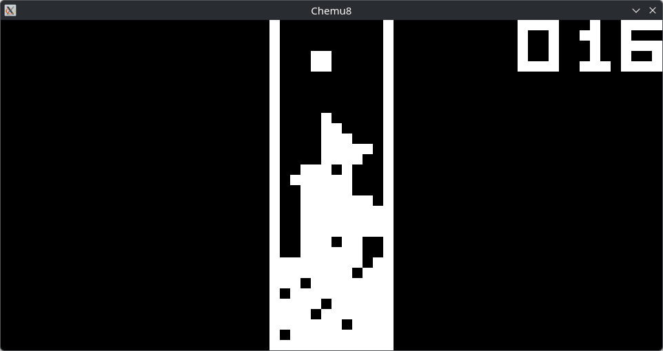

# Chemu8

[Try out the web version!](https://jacky161.github.io/Chemu8/)

Chemu8 is a Chip8 emulator written in Rust with both a web and native desktop version available. Both versions utilise the same core Rust backend, located inside the `chemu8_core` directory.



## Chemu8 Web

Chemu8 Web can be used in any reasonably modern web browser. The core Rust code is compiled to WebAssembly, allowing it to run natively inside of a browser. Vite with React is used for the frontend, with the game simply rendering onto an HTML5 Canvas.

## Chemu8 Desktop

Chemu8 Desktop can be compiled and ran on Windows/MacOS/Linux. The UI can be interacted with by pressing the indicated number keys on your keyboard. If you prefer, you may use CLI arguments to pass the ROM file, as well as enable/disable quirks (use the `--help` flag to view all options). The UI also features these same options.

### Compiling and Running

Download the latest release from the [releases page](https://github.com/Jacky161/Chemu8/releases) or clone the source code to compile it yourself.

> [!NOTE]
> MacOS users will need to unblock the application to allow it to run, as it is not notarized. To do this, go to System Settings -> Privacy & Security and press "Open Anyway" after attempting to launch the emulator once. You can also run `xattr -d com.apple.quarantine chemu8_desktop` to accomplish the same via the terminal.

#### Manual Compilation

Firstly, you will need to have a Rust toolchain installed. Consult the [official Rust documentation](https://rust-lang.org/tools/install/) for instructions. You will also need to install SDL2, alongside the `gfx` and `ttf` libraries.

##### MacOS

Assuming you have Homebrew installed:

```bash
brew install sdl2 sdl2_gfx sdl2_ttf
```

#### Linux

Use your distribution's package manager. Instructions for common distros are given below.

**Debian / Ubuntu Based**

```bash
sudo apt update
sudo apt install -y libsdl2-dev libsdl2-ttf-dev libsdl2-gfx-dev
```

**Arch Based**

```bash
sudo pacman -S --needed sdl2 sdl2_ttf sdl2_gfx
```

**Fedora / RHEL Based**

```bash
sudo dnf install -y SDL2-devel SDL2_ttf-devel SDL2_gfx-devel
```

After installing dependencies, `cd` into the `chemu8_desktop` folder and run `cargo build` or `cargo build --release` for a debug/release build respectively. The compiled binary can then be found at `./target/{debug/release}/chemu8_desktop`.

## Controls

The Chip8 features a keypad with 16 buttons, arranged in 4 rows of 4 buttons each. The mapping is standard across Chip8 emulators, and is as follows.

```
Keypad       Keyboard
+-+-+-+-+    +-+-+-+-+
|1|2|3|C|    |1|2|3|4|
+-+-+-+-+    +-+-+-+-+
|4|5|6|D|    |Q|W|E|R|
+-+-+-+-+ => +-+-+-+-+
|7|8|9|E|    |A|S|D|F|
+-+-+-+-+    +-+-+-+-+
|A|0|B|F|    |Z|X|C|V|
+-+-+-+-+    +-+-+-+-+
```

## Configuration

Currently, the only configurable option is quirks. By default, all quirks are enabled to maximize compatability out of the box.

Quirks stem from minor differences in the implementations of particular Chip8 instructions. The most common reference, [Cowgod](http://devernay.free.fr/hacks/chip8/C8TECH10.HTM) has some inaccuracies in the descriptions of `8xy6`, `8xye`, `fx55`, and `fx65`. Some games have been implemented assuming this inaccurate behaviour, leading to issues when playing them with emulators that have been implemented with corrected references.

Setting quirks enabled in Chemu8 (the default) will have the affected instructions behave according to the Cowgod reference. Disabling quirks will use the accurate behaviour as seen in corrected references (such as in [Matthew Mikolay's reference](https://github.com/mattmikolay/chip-8/wiki)).

Enabling or disabling quirks may be required for certain games to behave properly.

## ROMs

Find ROMs to use with this emulator here!

https://github.com/kripod/chip8-roms

## Resources

Here are the links to the resources I used to develop this emulator.

- https://github.com/aquova/chip8-book
- https://austinmorlan.com/posts/chip8_emulator/
- http://devernay.free.fr/hacks/chip8/C8TECH10.HTM
- https://github.com/mattmikolay/chip-8/wiki
- https://github.com/Timendus/chip8-test-suite
